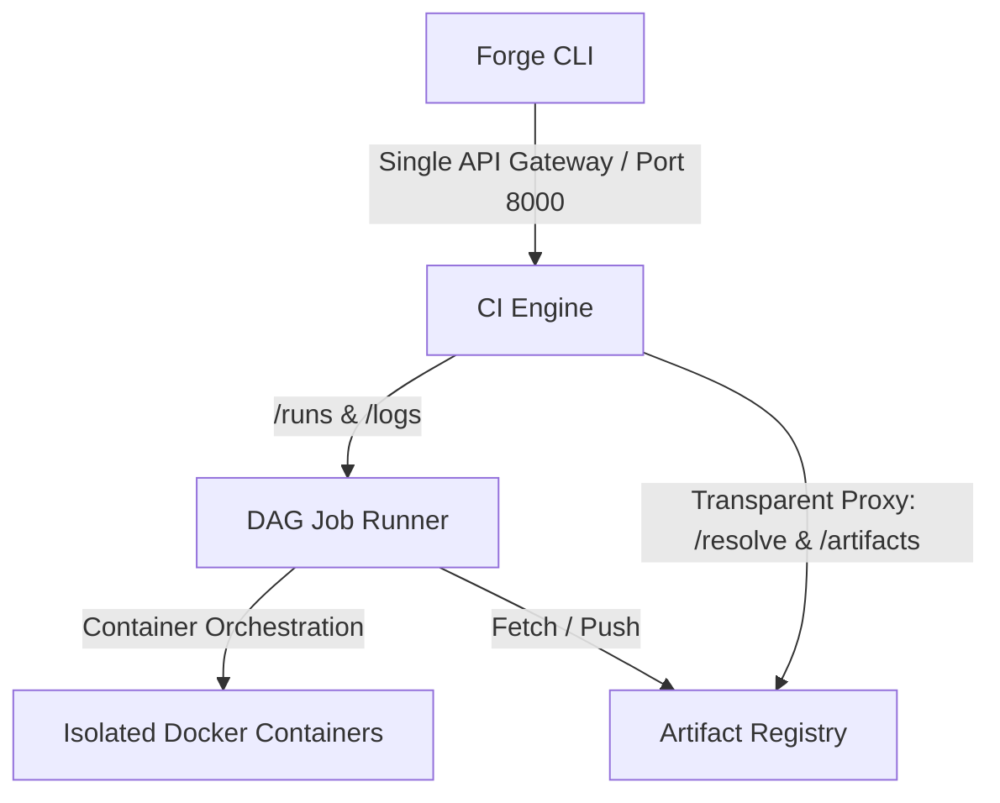

# Forge — CI/CD Platform with Integrated Artifact Registry

A robust, high-performance, and secure CI/CD engine built alongside an immutable artifact registry and deterministic dependency resolver.


## Architecture Overview

Forge consists of two cooperating subsystems unified behind a single HTTP API Gateway:
1. **The CI Engine (Port 8000):** Responsible for parsing pipelines, building/executing DAG schedules, running jobs in containerized isolation, and streaming logs.
2. **The Artifact Registry & Resolver (Port 8001):** Responsible for content-addressable artifact storage, version pinning, and transitive dependency resolution.



### 1. DAG Scheduler

The scheduler is implemented from scratch in `engine/scheduler.py` using three core functions that execute in sequence before any job container is launched:

**`build_dag(jobs)`** — Constructs an adjacency-list representation of job dependencies. Each job maps to a list of jobs it `needs`. If a job references a dependency that does not exist in the pipeline, a `ValueError` is raised immediately. Scalar `needs` values (e.g. `needs: build` instead of `needs: [build]`) are normalised to a list for consistency.

**`detect_cycles(dag)`** — Performs a full depth-first search (DFS) with three-colour marking to detect circular dependencies *before* any container is started:
- **White (0):** Unvisited node.
- **Grey (1):** Currently on the DFS stack (being visited). If a traversal encounters a grey node, a cycle has been found.
- **Black (2):** Fully explored, all descendants visited.

When a cycle is detected, the exact cycle path is extracted from the DFS stack and reported (e.g. `Cycle detected in job dependencies: job-a -> job-b -> job-a`), and the pipeline is rejected with an HTTP `422` status.

**`get_parallel_groups(dag)`** — Partitions jobs into ordered execution groups using a level-based topological sort. In each iteration, all jobs whose dependencies have already completed are collected into a "ready" group. These groups are processed sequentially by the runner — within each group, all jobs are launched concurrently via `asyncio.gather()`, **throttled by an `asyncio.Semaphore`** to enforce the configurable concurrency limit (`engine.max_concurrency` in `config.yaml`, default 4). If a group has 8 independent jobs and `max_concurrency` is 4, only 4 containers run simultaneously; as each finishes, the next one starts.

**Skipped state propagation:** When any job in a group fails, the runner immediately marks all remaining queued jobs as `skipped` (not `failed`), clearly distinguishing between a job that actually broke and downstream jobs that never ran.

### 2. Isolated Build Environments

Each job runs inside a dedicated Docker container with strict multi-dimensional isolation enforced in `engine/runner.py`:

**Filesystem isolation:**
- Each job receives its own dedicated workspace directory, bind-mounted at `/workspace` in read-write mode.
- Resolved dependencies are mounted at `/workspace/deps` in **read-only** mode — jobs can read their deps but cannot tamper with them.
- No part of the host filesystem is exposed beyond these two directories. The host's `/etc`, `/proc`, `/var`, and root filesystem are completely invisible to build containers.

**Process isolation:**
- Containers run in their own PID namespace (Docker default). Processes inside the container cannot see or signal any processes on the host or in other build containers.
- `cap_drop=["ALL"]` drops every Linux kernel capability. Even a root process inside the container cannot mount filesystems, modify network tables, load kernel modules, or perform any privileged operation.
- `security_opt=["no-new-privileges"]` prevents any child process from escalating privileges via setuid/setgid binaries.

**Network isolation:**
- Each job runs on a **per-job internal bridge network** (`forge-<run_id>-<job_name>`, created with `internal=True`). The `internal` flag strips the default gateway, blocking all outbound traffic to the internet.
- The registry container is dynamically discovered via its `com.docker.compose.service=registry` label and attached to this per-job network with a `registry` alias. This allows build steps to reach the registry (and only the registry) for imperative `forge publish` commands.
- The engine injects `FORGE_URL` (pointing to `http://registry:8001`) and `FORGE_TOKEN` environment variables into each container.

**CPU and memory limits:**
- CPU limits are set via `nano_cpus` (e.g. `cpu: 1.0` → `1000000000` nanosecond CPU shares).
- Memory limits are translated from the YAML format (`512Mi` → `512m`, `1Gi` → `1g`) and enforced via Docker's `mem_limit` parameter.
- If a job exceeds its memory allocation, Docker's OOM killer terminates the process and the runner logs a clear `Job killed: Out of Memory (OOM)` signal by inspecting `container.attrs["State"]["OOMKilled"]`.

**Wall-clock timeout:**
- A configurable per-job timeout (default: 1800 seconds / 30 minutes, set in `config.yaml` under `engine.default_job_timeout`) is enforced by an async `_timeout_container` task that runs concurrently alongside log streaming.
- If the timeout fires, the container is forcibly killed and a `TIMEOUT: Job exceeded Xs limit. Killing container.` message is logged.

**Container cleanup:**
- Every container is forcibly removed in a `finally` block regardless of success or failure.
- The registry container is disconnected from the per-job network, and the per-job network is removed, preventing resource leaks across pipeline runs.

### 3. Storage Layer

The artifact registry uses a **content-addressable storage (CAS)** model implemented in `registry/storage.py`:

- **Blob storage:** Artifact files are written to disk at `<storage_path>/blobs/<sha256_hex>`. The filename *is* the SHA-256 hex digest of the file's content. Identical files uploaded by different pipelines are automatically deduplicated — if a blob with the same hash already exists, the write is skipped entirely.
- **Retrieval by path:** `get_blob()` returns a `pathlib.Path` rather than loading file bytes into memory. This allows FastAPI's `FileResponse` to stream large artifacts directly from disk without buffering.
- **Server-side checksum verification:** On upload, the registry recomputes the SHA-256 of the received bytes and compares it against the client-declared `checksum` field. A mismatch is rejected with HTTP `400`. The `sha256:` prefix is stripped if present before comparison.

**Metadata is stored in SQLite** (`registry/metadata.py`):
- Table `artifacts` has columns: `id`, `name`, `version`, `sha256`, `size`, `publisher`, `deps_json`, `published_at`.
- A `UNIQUE(name, version)` constraint enforces **immutability** at the database level. A second upload of the same `(name, version)` raises a `ConflictError` mapped to HTTP `409`.
- The `deps_json` column stores the declared dependency list as a serialised JSON array, enabling the resolver to walk transitive dependencies from registry metadata alone.
- A schema migration check ensures backward compatibility: if the table was previously created without the `size` column, an `ALTER TABLE` is executed automatically on startup.

**Semver validation:** Versions are validated against the full SemVer 2.0.0 specification regex on upload. Non-semver versions (e.g. `latest`, `abc`) are rejected with HTTP `400`.

### 4. Dependency Resolver

The resolver is a fully custom, recursive backtracking constraint solver implemented in `registry/resolver.py`. No external semver library is used.

**Custom `Version` class:**
- Parses SemVer strings (with optional `v` prefix) into `(major, minor, patch, prerelease, build)` components using a strict regex.
- Implements full comparison operators (`<`, `<=`, `>`, `>=`, `==`) with correct SemVer precedence: prerelease versions sort *before* their release counterparts (e.g. `1.0.0-alpha < 1.0.0`). Prerelease identifiers are compared lexically for strings and numerically for digits.

**Constraint parsing (`parse_constraint_term`):**
- Supports exact (`=1.0.0`), caret (`^1.0.0`), tilde (`~1.2.0`), and comparator ranges (`>=1.0.0`, `<2.0.0`, `>1.0.0`, `<=1.5.0`).
- Multiple constraints can be combined with spaces or commas and are evaluated as a logical AND (all must be satisfied).
- Handles partial versions: `^1` means `>=1.0.0 <2.0.0`, `~1.2` means `>=1.2.0 <1.3.0`.
- Caret semantics respect leading zeroes: `^0.2.3` pins to `0.2.x`, `^0.0.3` pins to exactly `0.0.3`.

**Transitive resolution (`_solve`):**
- Uses a recursive backtracking algorithm. For each unresolved package, all available versions are retrieved from the SQLite metadata store and sorted in descending order (highest first).
- Each candidate version is tested against all accumulated constraints from every path that depends on it. If the candidate satisfies all constraints, its own declared dependencies are added to the front of the resolution queue, and the solver recurses.
- If a candidate leads to a downstream conflict, the solver backtracks and tries the next candidate version.

**Cycle detection in the dependency graph:**
- Each recursive call carries a `parent_path` tuple. If a package name appears in its own `parent_path`, a `CycleError` is raised with the full cycle path (e.g. `Dependency cycle detected: lib-a -> lib-b -> lib-a`).

**Conflict reporting:**
- When no version of a package can satisfy all accumulated constraints, a `ConflictError` is raised that includes the conflicting constraint strings and the full dependency path that introduced each constraint (e.g. `Version conflict for package 'lib-core': ...constraints: '^1.0.0' from root, '>=2.0.0' from lib-http`).

**Determinism:**
- The final lockfile is built by iterating over `sorted(resolved.keys())`, ensuring package ordering is always alphabetical.
- Within each package, the highest satisfying version is always selected first (descending sort), so given the same registry state, the same pipeline always produces an identical lockfile.

**Lockfile format:**
```json
{
  "packages": {
    "lib-core": {
      "version": "1.2.0",
      "sha256": "abc123...",
      "dependencies": [...]
    }
  }
}
```

### 5. Real-Time Log Streaming & SSE Log Termination
Forge streams stdout/stderr outputs in real-time over **Server-Sent Events (SSE)**.
* **Efficient Memory Usage:** Large log outputs (tested up to 50MB) are streamed line-by-line using a generator that yields events from disk, avoiding buffering entire log files in-memory.
* **Termination Awareness:** The logs stream tracks the pipeline status. As soon as the run enters a terminal state (`succeeded`, `failed`, `integrity_failure`, `conflict_failure`, `cycle_failure`), the SSE polling loop cleanly breaks and terminates the connection, resolving the infinite polling bug.

### 6. Unified API Gateway
Although the CI Engine and Artifact Registry run as separate microservices, the CLI is configured with a single URL.
* The **CI Engine acts as an API Gateway** on port `8000`.
* All requests directed to `/resolve` or `/artifacts/...` are transparently proxied using an asynchronous `httpx` client to the internal registry URL (`http://registry:8001`), maintaining all headers, tokens, and payloads.

---

## Concurrency & Race Conditions

### Handling Twin Registry Publishes

When two pipelines race to publish the same `(name, version)` simultaneously, immutability is enforced through a two-layer defense:

1. **Application-level check (`metadata.py`):** Before inserting a new artifact record, `save_artifact()` calls `get_artifact(name, version)` to check if the `(name, version)` pair already exists. If it does, a `ConflictError` is raised immediately and the upload is rejected with HTTP `409`.

2. **Database-level constraint:** The SQLite `artifacts` table is defined with `UNIQUE(name, version)`. Even if two concurrent requests pass the application-level check simultaneously (a TOCTOU race), the `INSERT` statement will fail with an `IntegrityError` at the database level. SQLite's default serialised write locking ensures that only one of the two competing inserts can succeed — the other receives a constraint violation.

3. **Content-addressable deduplication (`storage.py`):** On the blob storage side, `save_blob()` computes the SHA-256 of the file bytes and writes to `<hash>`. If the blob already exists on disk (checked via `path.exists()`), the write is skipped entirely. Since the filename is deterministic and derived from the content hash, two identical files can never corrupt each other — the operation is naturally idempotent.

This layered approach ensures that published versions are truly immutable: the first writer wins, and all subsequent attempts receive a clear `409 Conflict` error.

---

## Slack Alerts

Forge fires rich, interactive Slack notifications to keep teams updated on pipeline health and security events. The webhook URL is configured via `.env`.

* **Pipeline Started / Succeeded / Failed:** Reports the pipeline name, Run ID, execution duration, and lists the exact job that failed (if any) with customized color-coding (🚀 blue for started, ✅ green for succeeded, ❌ red for failed).
* **Dependency Resolution Failure:** Reports syntax/YAML validation errors, version conflict paths, or circular dependencies with ⚠️ yellow alert styling.
* **Integrity Failure (Security):** Fires a high-priority alert tagging `<!channel>` immediately if a downloaded artifact's re-computed SHA-256 does not match the lockfile hash, halting the pipeline. Includes the artifact coordinate, expected and actual SHA-256 hashes, and the run ID.


---

## Pipeline YAML Schema

Forge pipelines are declared using a declarative YAML format. Below is an annotated schema:

```yaml
name: build-lib-http           # Required. Name of the pipeline
version: 1.0.0                 # Required. Package version of the final artifact

dependencies:                  # Optional. External library dependencies to fetch
  - name: lib-core
    version: "^1.0.0"          # Semver constraint (supports caret, tilde, comparator ranges)

jobs:                          # Required. Map of jobs to execute
  build:
    runtime: alpine:3.18       # Required. Container environment to execute within
    resources:                 # Optional. Core resource limits
      cpu: 1.0
      memory: 512Mi
    steps:                     # Required. List of sequential run steps
      - { name: test, run: "sh ./test.sh" }
      - { name: package, run: "tar czf out.tar.gz src/" }

artifacts:                     # Optional. Output artifacts to publish on job success
  - { name: lib-http, version: 1.0.0, path: ./out.tar.gz }
```

---

## Step-by-Step VPS Setup Guide

### 1. Prerequisites
Ensure your Linux VPS has `Docker` and `Docker Compose` installed.

### 2. Clone the Repository & Configure Environment
```bash
git clone <your-repo-url> forge
cd forge

# Configure your secure Slack webhook (ignored by git)
echo "SLACK_WEBHOOK_URL=https://hooks.slack.com/services/..." > .env
```

### 3. Deploy Platform
```bash
docker compose up -d --build
```

### 4. Create Your First Auth Token
Run the token generator utility inside the running registry container to generate a secure hashed auth token:
```bash
docker compose exec registry python -m registry.auth create <label>
```
> [!WARNING]
> Save the returned raw token! It is cryptographically hashed in the database using SHA-256 and cannot be recovered.

### 5. CLI Installation & Login
```bash
# Install the CLI tool in editable mode
pip install -e ./cli

# Authenticate against your unified gateway (port 8000)
forge login http://localhost:8000
# Enter your saved raw token when prompted
```

### 6. Verify Platform
```bash
# Test dependency resolution
forge resolve test.yaml

# Run a pipeline
forge run test.yaml

# Monitor logs live (using the returned Run ID)
forge logs <run_id> --follow
```